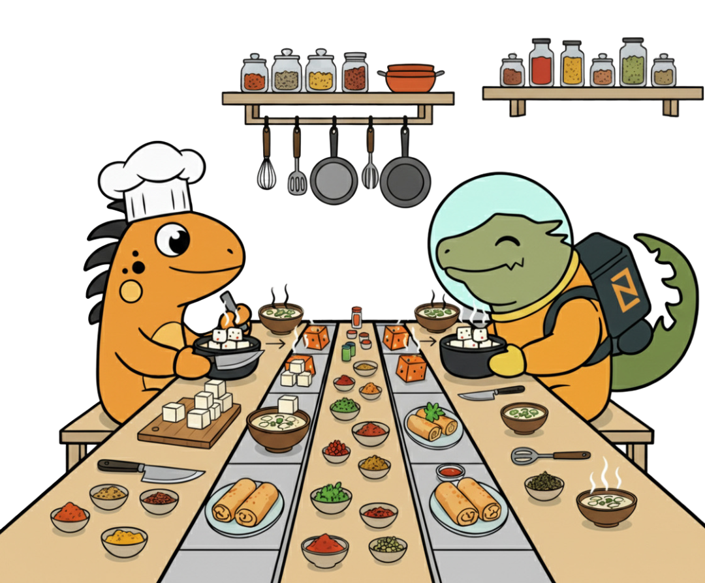

# tofu - To Feel Unstoppable

<!--  -->
##
A “cool” slogan. 

But what does **tofu** have to do with a library for 
_asynchronous message communication_?

I spent a long time racking my brain trying to explain the _point_ of this project.

There are already tons of networking libraries out there 
(well, let’s say at least “half a kilo” for Zig). 

And then it hit me — tofu!

Tofu is a simple product with almost no flavor. You can 
- eat it plain with no fuss
- add a little spice and make something simple
- or go all the way and create culinary masterpieces.

That’s the metaphor for the tofu library: 
- from minimal setups 
- to more complex flows
- and eventually distributed applications.

## A bit of history

_tofu_ wasn’t “pulled out of thin air.” 
I started developing a similar system back in 2008, maintained it, and kept it running for years. 
That system powered all data exchange in a serious distributed environment 
- from basic IPC 
- to communication in a proprietary distributed file system.

We’ve “parted ways” for a few years now, but I haven’t heard any complaints yet.

Corporate lawyers can relax — from that old system I only took the _scent_. 
By that I mean the idea itself: 
- messaging as the foundation
- the philosophy of gradual evolution 
  - starting from something simple 
  - and steadily growing into more advanced and powerful systems.

## API

You won’t find the tofu API here yet.

As development moves forward, I’ll be preparing proper documentation.

A link will be added at the time of project “publication.”

## Credits

- Karl Segal — for introducing me to Zig networking
- tardy — I peeked into 2 files of the project (the author will know which ones)
- tp — helped me (and will help you) work with temporary files
- Gemini AI image generator — the only one out of six I managed to convince to seat Ziggy and Zero at the same table

## Why not use another library?

Why not? — Go ahead and use it.

## Last but not least

⭐️ Like, share, and don’t forget to “subscribe to the channel”!

