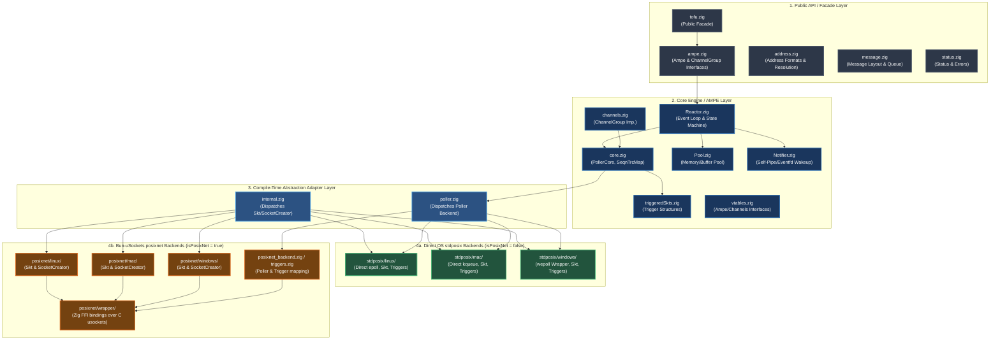
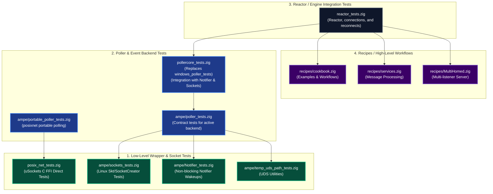

# Tofu Architecture & Test Relations Analysis

This document provides a layered architecture diagram of the `tofu` Zig messaging library implementation and visualizes the relationships between its test groups, excluding the platform-independent/no-socket tests requested.

---

## 1. Layered Architecture Diagram

---

## 2. Test Groups & Relations Diagram

The diagram below shows the relationships between active test groups. High-level integration tests build on engine integration, which builds on poller backends, which in turn build on low-level wrappers and socket layers.

*Note: As requested, platform-independent non-socket tests (`Pool_tests`, `channels_tests`, `address_tests`, and `message_tests`) are excluded from this analysis.*

---

## 3. Detail of Implementation Layers

### 1. Public API / Facade Layer
- **`tofu.zig`**: The entrypoint, re-exporting key types (`Ampe`, `ChannelGroup`, `Options`, `Reactor`, `Skt`, `SocketCreator`, and platform initialization/destruction helpers) to keep the client interface clean and unified.
- **`ampe.zig`**: Houses the abstract `Ampe` and `ChannelGroup` interfaces. These interfaces route calls through runtime virtual method tables (`AmpeVTable` and `CHNLSVTable`).
- **`address.zig` & `message.zig`**: Handles structure layouts, TCP/IP/Unix domain addresses, frame structures (`BinaryHeader`), `OpCode` state, and internal `MessageQueue`.

### 2. Core Engine / AMPE Layer
- **`Reactor.zig`**: The event-driven heart. It orchestrates the asynchronous flow using state transitions and non-blocking I/O.
- **`channels.zig`**: Bridges `ChannelGroup` to the core polling/queuing components.
- **`core.zig`**: Holds the `PollerCore` event loop and structures like `SeqnTrcMap` (mapping sequence numbers to channels to protect against ABA issues).
- **`Pool.zig`**: A highly optimized message block allocator that keeps memory allocations predictable.
- **`Notifier.zig`**: Provides a thread-safe, cross-platform notifier (self-pipe/loopback/eventfd) to safely wake the `waitReceive` thread.

### 3. Compile-Time Abstraction Adapter Layer
- **`internal.zig`**: Resolves `Skt` and `SocketCreator` compile-time mappings based on the chosen network backend (`posixnet` vs. `stdposix`) and OS.
- **`poller.zig`**: Selects the active `Poller` backend implementation, dispatching to epoll, kqueue, wepoll, or posixnet.

### 4. Platform-Specific Implementations
- **`stdposix` Backend**: Native, zero-dependency Zig standard library implementation tailored specifically to the host system (`epoll` for Linux, `kqueue` for macOS/BSDs, and `wepoll` for Windows).
- **`posixnet` Backend**: Interfaces through C FFI wrappers (`posix_net`) over `bun-usockets` (originally from the Bun project), facilitating portable socket handling.

---

## 4. Summary of Analyzed Test Groups

1. **Low-Level Wrapper & Socket Tests**:
   - **`posix_net_tests.zig`**: Direct testing of the low-level `bun-usockets` FFI.
   - **`sockets_tests.zig`**: Directly exercises the platform `Skt` / `SocketCreator` interface on Linux.
   - **`Notifier_tests.zig`**: Verifies that the notifier correctly wakes up polling loops thread-safely.
   - **`temp_uds_path_tests.zig`**: Tests generation and clean-up of temporary UDS file system paths.

2. **Poller / Event Backend Tests**:
   - **`poller_tests.zig`**: Runs contract tests validating timeouts, readability/writability transitions, unregistering event loops, and sequence-based ABA protection.
   - **`portable_poller_tests.zig`**: Validates the portable event loop abstraction for `posixnet`.
   - **`pollercore_tests.zig`**: Runs full integration of `PollerCore`, validating Notifier interrupts, socket attachment, connection acceptance, and raw network data roundtrips.

3. **Reactor / Engine Integration Tests**:
   - **`reactor_tests.zig`**: High-level system integration tests covering connection/disconnection lifecycles, reconnect flows, illegal frame handling, and concurrent/multithreaded simulation tasks.

4. **Recipes / Workflows (High-Level Workflows)**:
   - **`MultiHomed.zig`**, **`cookbook.zig`**, and **`services.zig`**: Demonstrates the real-world usage patterns of the tofu framework, serving as complex operational validation tests.
