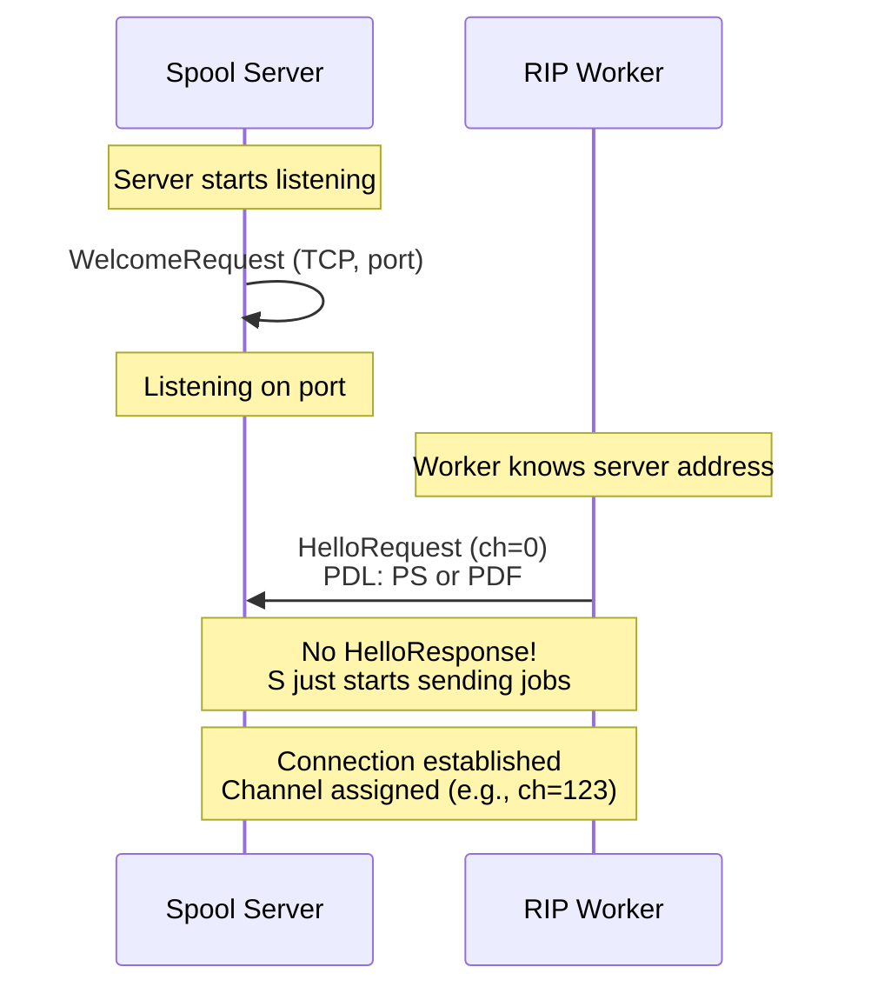
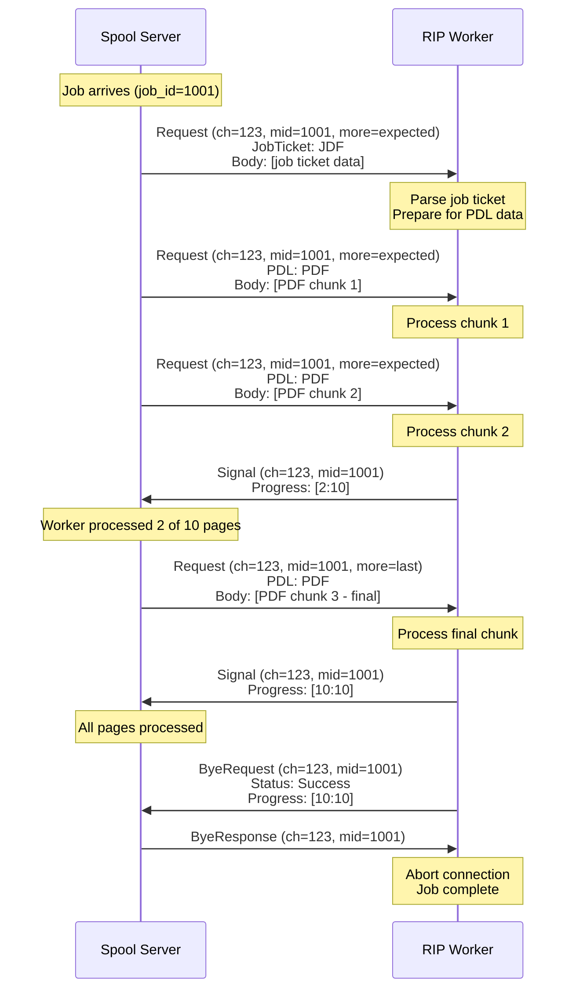
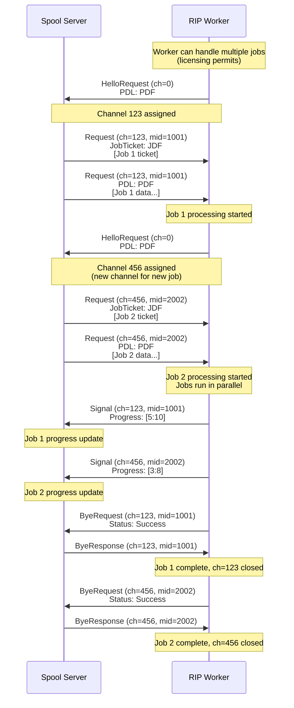
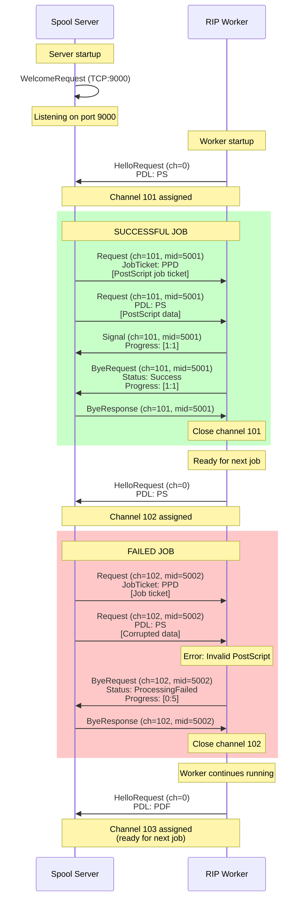
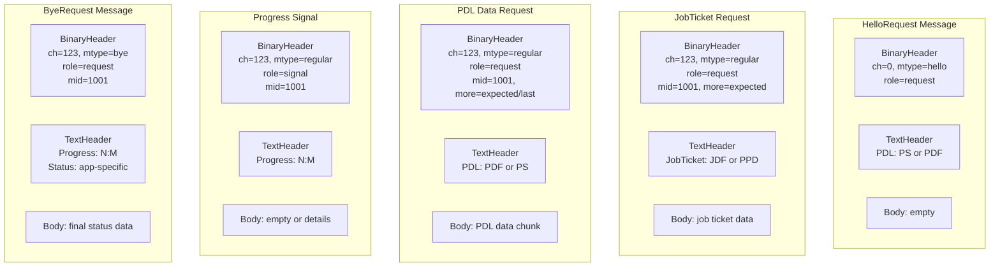

## Context

This document captures a technical conversation between two developers designing a _Print Server system_ using the tofu messaging framework. 
This exemplifies tofu's core philosophy: **development starts with a conversation** between developers, not with API specifications.

Participants:

- **S (Spool Server Developer):** Manages print job queue and distribution
- **R (RIP Worker Process Developer):** Performs Raster Image Processing on print jobs

---

## The Conversation

This is the technical conversation that defines the entire protocol. Notice how natural message flow emerges from developer discussion rather than formal API design.

```
S: I don't know the addresses of the workers, so you should connect to me.

R: I'll send a HelloRequest, because the worker can process only specific PDL types,
   the PDL header will contain either PS or PDF.

S: Do I need to send you a HelloResponse?

R: No, just start sending me messages with PDL data.

S: As signals?

R: No, as multi-requests — each with a message ID equal to the job ID.

S: You forgot the Job Ticket.

R: Right. The first request should have a JobTicket header (JDF or PPD) and the
   ticket data in the body. The following requests will have the PDL header
   (PDF or PS) with the related content.

S: But JDF is usually used only for PDF...

R: Yes, but let's keep it flexible.

S: Can you process several jobs simultaneously?

R: It depends on licensing. Anyway, if I can, I'll send another HelloRequest —
   working one job per channel looks cleaner.

S: I need a progress indicator.

R: No problem. I'll send signals with the same message ID — the Progress header
   will show the range [N:M] for page numbers.

S: On job finish, send me a Response with the same message ID and processing status.
   Also include the Progress header.

R: Why should I send an obsolete message? Are you expecting a graceful close?

S: Of course.

R: Then I'll send a ByeRequest with the same information, and you'll send me a
   ByeResponse. After that, I'll abort the connection immediately.

S: That's enough for today. Send me a short text file with this protocol —
   I'll save it in Git.

R: Deal. How about a cup of coffee?
```

---

## Protocol Analysis

### Key Decisions Made

| Decision | Rationale |
|----------|-----------|
| **R connects to S** | S doesn't know worker addresses upfront |
| **PDL type in HelloRequest** | Workers are specialized (PS or PDF only) |
| **No HelloResponse** | Streamlined - S just starts sending jobs |
| **Multi-requests with job_id** | All chunks of one job share same message_id |
| **JobTicket first, then PDL** | Job metadata separate from actual data |
| **One job per channel** | Clean separation, easier state management |
| **Progress as signals** | One-way updates, no response needed |
| **ByeRequest for completion** | Graceful close with final status |

### Message Types Defined

1. **HelloRequest** - Worker announces capabilities (PDL: PS or PDF)
2. **JobTicket Request** - First request with job metadata (JDF/PPD)
3. **PDL Data Requests** - Subsequent requests with actual print data
4. **Progress Signals** - Status updates during processing
5. **ByeRequest** - Job completion with final status
6. **ByeResponse** - Server acknowledges completion

---

## Communication Diagrams

### Diagram 1: Connection Establishment



**Key Points:**
- S (Server) creates listener via WelcomeRequest
- R (Worker) connects and sends HelloRequest with PDL capability
- No HelloResponse - streamlined connection
- Channel number assigned for this connection

---

### Diagram 2: Single Job Processing Flow



**Key Points:**
- All messages for one job use same message_id (job_id)
- First request: JobTicket header + ticket data
- Subsequent requests: PDL header + PDL data chunks
- `more` flag: `.expected` until last chunk (`.last`)
- Progress signals: Fire-and-forget updates [current:total]
- ByeRequest/ByeResponse: Graceful close with final status

---

### Diagram 3: Multi-Job Processing (Multiple Channels)



**Key Points:**
- Worker sends multiple HelloRequests for parallel jobs
- Each job gets its own channel (clean separation)
- Channel 123 handles job_id=1001
- Channel 456 handles job_id=2002
- Jobs processed independently
- Each channel closed via ByeRequest/ByeResponse

---

### Diagram 4: Complete Lifecycle with Error Handling



**Key Points:**
- Worker lifecycle spans multiple jobs
- Successful job: Status=Success in ByeRequest
- Failed job: Status=ProcessingFailed (or other error)
- Progress header shows how far processing got
- Worker remains connected, ready for next job
- Each job gets fresh channel via new HelloRequest

---

### Diagram 5: Message Structure Details



---

## Protocol Summary

### Message Flow Patterns

**Pattern 1: Connection**
```
Worker → Server: HelloRequest (PDL capability)
[No response - Server just starts sending]
```

**Pattern 2: Job Submission (Multi-Request)**
```
Server → Worker: Request (JobTicket + ticket data, mid=job_id, more=expected)
Server → Worker: Request (PDL + data chunk 1, mid=job_id, more=expected)
Server → Worker: Request (PDL + data chunk 2, mid=job_id, more=expected)
...
Server → Worker: Request (PDL + data chunk N, mid=job_id, more=last)
```

**Pattern 3: Progress Updates (Signals)**
```
Worker → Server: Signal (Progress: [current:total], mid=job_id)
Worker → Server: Signal (Progress: [current:total], mid=job_id)
...
```

**Pattern 4: Job Completion (Graceful Close)**
```
Worker → Server: ByeRequest (Status + Progress, mid=job_id)
Server → Worker: ByeResponse (mid=job_id)
[Worker closes connection]
```

---

## Headers Dictionary

### Headers Used in This Protocol

| Header | Values | Usage | Message Types |
|--------|--------|-------|---------------|
| **PDL** | `PS`, `PDF` | Page Description Language type | HelloRequest, PDL Requests |
| **JobTicket** | `JDF`, `PPD` | Job ticket format | First Request per job |
| **Progress** | `[N:M]` | Current page : Total pages | Signals, ByeRequest |
| **Status** | Application-defined | Job processing result | ByeRequest (in body or header) |

### Message ID Strategy

- **message_id = job_id** for all messages related to one job
- Enables correlation: all chunks, progress updates, and completion share same ID
- Example: Job 1001 uses mid=1001 throughout its lifecycle

---

## Design Insights

### Why This Conversation Matters

This conversation demonstrates tofu's core philosophy:

1. **Natural Protocol Evolution:**
   - Started with basic connection ("you should connect to me")
   - Evolved through discussion (multi-requests, job tickets, progress)
   - Refined with experience ("JDF is usually only for PDF" → "let's keep it flexible")

2. **Developer-Driven Design:**
   - No formal specification written first
   - Protocol emerged from understanding requirements
   - Both developers contributed to shape the flow

3. **Flexibility Over Rigidity:**
   - "Let's keep it flexible" - design for change
   - Multi-channel support added mid-conversation
   - Progress updates added when need identified

4. **Message-as-Cube Approach:**
   - Each message type is a building block
   - Combine HelloRequest + JobTicket + PDL Requests + Signals + ByeRequest
   - Result: Complete print job processing workflow

### Translation to Code

After this conversation, developers can:

1. **Write Protocol Documentation:** (Simple text file for Git)
   ```
   PROTOCOL: Spool Server ↔ RIP Worker

   1. Worker → Server: HelloRequest, PDL: PS|PDF
   2. Server → Worker: Multi-requests (job_id)
      - First: JobTicket: JDF|PPD, body: ticket
      - Rest: PDL: PS|PDF, body: data chunks
   3. Worker → Server: Signals, Progress: [N:M]
   4. Worker → Server: ByeRequest, Status + Progress
   5. Server → Worker: ByeResponse
   ```

2. **Implement Using Tofu:**
   - Use tofu's Message structure
   - Configure TCP server/client
   - Implement message handlers
   - No complex code generation needed

3. **Iterate Quickly:**
   - Test with real data
   - Adjust headers as needed
   - Add new message types if requirements change

---

## Comparison with Traditional Approaches

### API-First (gRPC, REST) Approach

```protobuf
// Would require formal IDL
service PrintServer {
  rpc SubmitJob(JobRequest) returns (JobResponse);
  rpc StreamPDL(stream PDLChunk) returns (stream Progress);
  rpc GetStatus(JobID) returns (JobStatus);
}

message JobRequest {
  string job_ticket_format = 1;  // JDF or PPD
  bytes job_ticket = 2;
  string pdl_type = 3;           // PS or PDF
}

message PDLChunk {
  int64 job_id = 1;
  bytes data = 2;
  bool is_last = 3;
}

// ... more formal definitions
```

**Problems:**
- Requires IDL file before coding
- Code generation step needed
- Changes require regeneration
- Versioning complexity
- Lost flexibility

### Tofu (Message-First) Approach

```
Conversation → Text Protocol → Implementation
- No IDL needed
- No code generation
- Direct implementation
- Easy to change
- Full flexibility
```

**Advantages:**
- Start coding immediately after conversation
- Protocol is the documentation
- Changes are simple (add headers, adjust messages)
- Natural evolution based on real usage

---

## Lessons for Protocol Design

### From This Conversation

1. **Start with Connection Pattern:**
   - Who connects to whom?
   - What capabilities need to be announced?

2. **Identify Message Roles:**
   - Requests that expect responses
   - Signals for one-way notifications
   - Multi-message sequences (job chunks)

3. **Use Headers for Metadata:**
   - PDL type (PS/PDF)
   - Job ticket format (JDF/PPD)
   - Progress indicators ([N:M])

4. **Leverage Message ID:**
   - Correlation across multi-message flows
   - Business transaction ID (job_id = message_id)

5. **Design for Lifecycle:**
   - Connection establishment (Hello)
   - Data exchange (Requests/Signals)
   - Graceful termination (Bye)

6. **Plan for Scale:**
   - Multiple channels for parallel processing
   - Clean separation (one job per channel)

---

## Next Steps for Developers

After this conversation, S and R would:

1. **Write Brief Protocol Doc:** (Save in Git)
   - Copy conversation or summary
   - Add message format details
   - Document headers

2. **Create Test Scenarios:**
   - Single job end-to-end
   - Multi-job parallel processing
   - Error handling (corrupted PDL)

3. **Implement Incrementally:**
   - Basic connection first
   - Single job flow
   - Progress updates
   - Multi-job support

4. **Iterate Based on Reality:**
   - Discover edge cases
   - Adjust message flow
   - Add new headers as needed

---

## Conclusion

This conversation exemplifies tofu's philosophy:

> **"Connect your developers. Then connect your applications."**

The protocol emerged naturally from:
- Understanding requirements (print job processing)
- Developer expertise (PDL types, job tickets)
- Practical constraints (unknown worker addresses)
- Refinement through discussion (progress updates, graceful close)

**Result:** A working protocol defined in 15 lines of conversation, implemented with simple message passing, flexible enough to evolve.

**No API specs. No code generation. No framework lock-in. Just messages flowing between peers.**

---
