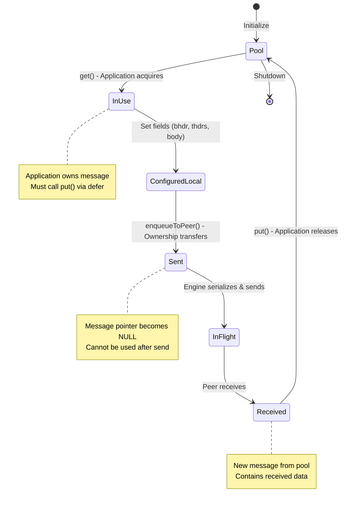
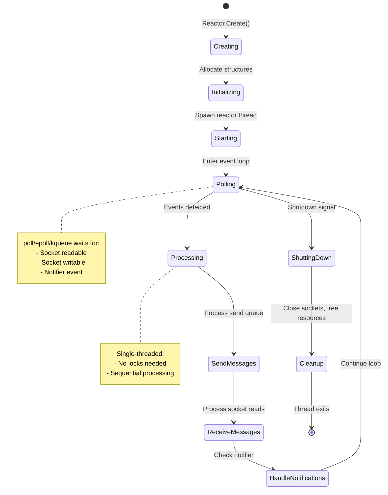
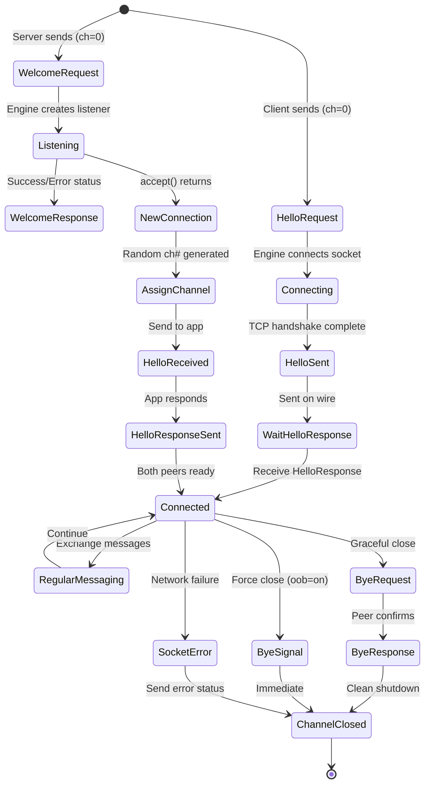
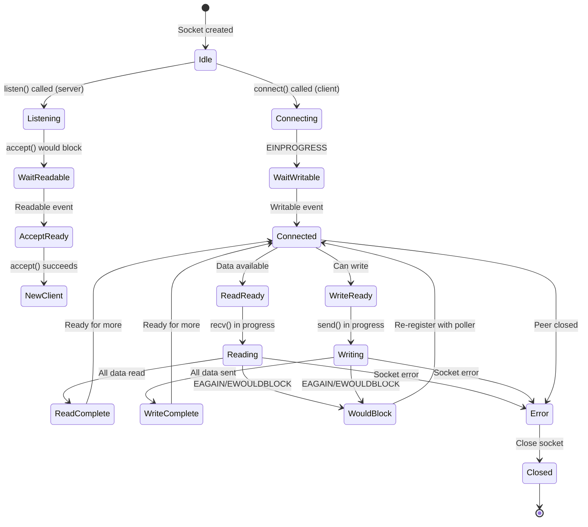
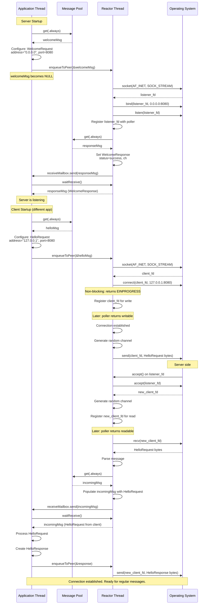
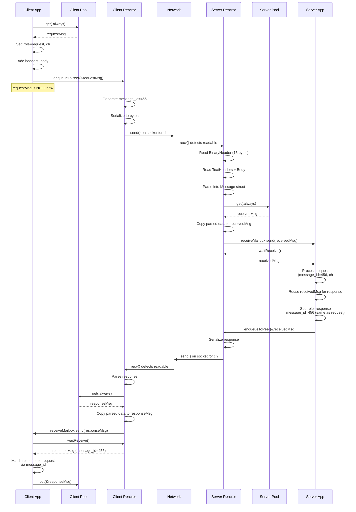
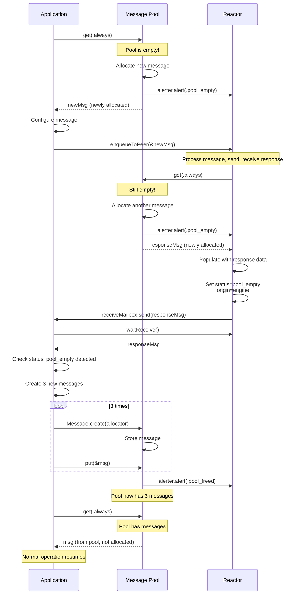
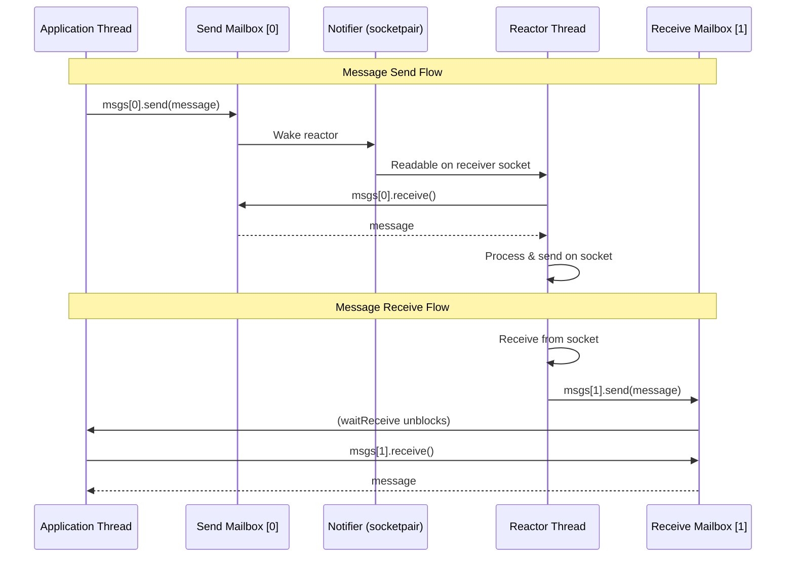

# PROJECT ARCHITECTURE & IMPLEMENTATION

This section describes the tofu project comprehensively, independent of porting concerns.

---

## 1.1 High-Level Philosophy

### Core Principles

**1. "The Message is the API"**

- The data structure itself defines the communication contract
- No complex API interfaces, RPC definitions, or service interfaces required upfront
- The message structure IS the contract

**2. "Gradual Evolution"**

- Start with something simple and grow it into a powerful system over time
- Begin with basic message exchange, then add complexity as needed

**3. "Connect your developers. Then connect your applications."**

- Development starts with a **conversation** between developers, not with API specifications
- See the S/R Dialog pattern in README.md for exemplar

### The Message-as-Cube Metaphor

As food, **tofu** is very simple and has almost no flavor on its own.
By using tofu **cubes**, you can:

- Eat it **plain** for a simple snack
- Add a little **spice** to make it better
- Create a **culinary masterpiece**

As a **protocol**, tofu uses **messages** like cubes.
By "cooking" these messages together, you can grow your project:

- Start with **minimal setups**
- Build **complex flows**
- Create full **distributed applications**

### What Tofu Provides

- **Foundation layer** for asynchronous message passing
- **Stream-oriented transport** (TCP/IP and Unix Domain Sockets)
- **Pool-based memory management** with backpressure control
- **Thread-safe APIs** for multi-threaded applications
- **Reactor pattern** for efficient I/O multiplexing
- **Peer-to-peer, full-duplex** communication after handshake

### What Tofu Does NOT Provide

- High-level serialization (JSON, Protobuf, etc.) - user chooses
- Authentication/authorization - user implements
- Load balancing, service discovery - user designs
- Opinionated business logic patterns

---

## 1.2 System Architecture

### Top-Level Components

```
┌─────────────────────────────────────────────────────────┐
│                    Application Layer                    │
│  (User code using tofu API - Services, Clients, etc.)   │
└────────────────────┬────────────────────────────────────┘
                     │
┌────────────────────▼──────────────────────────────────── ┐
│                  Public API Layer                        │
│  ┌──────────────────┐        ┌──────────────────────┐    │
│  │      Ampe        │        │   ChannelGroup       │    │
│  │   Interface      │◄───────┤    Interface         │    │
│  └──────────────────┘        └──────────────────────┘    │
│         │                              │                 │
│         │                              │                 │
│  ┌──────▼──────────────────────────────▼──────────────┐  │
│  │              Message Pool                          │  │
│  │  (Pool.zig - LIFO, mutex-protected)                │  │
│  └────────────────────────────────────────────────────┘  │
└───────────────────────────────────────────────────────── ┘
                     │
┌────────────────────▼────────────────────────────────────┐
│               Engine Layer (Reactor)                    │
│  ┌──────────────┐  ┌─────────────┐  ┌────────────────┐  │
│  │   Reactor    │  │   Notifier  │  │ActiveChannels  │  │
│  │  (Event Loop)│  │ (socketpair)│  │  (Registry)    │  │
│  └──────┬───────┘  └──────┬──────┘  └────────┬───────┘  │
│         │                 │                    │        │
│  ┌──────▼─────────────────▼────────────────────▼──────┐ │
│  │           Poller (poll/epoll/kqueue)               │ │
│  └────────────────────────┬───────────────────────────┘ │
└───────────────────────────┼─────────────────────────────┘
                            │
┌───────────────────────────▼─────────────────────────────┐
│                    OS Layer                             │
│  ┌────────────────┐          ┌──────────────────────┐   │
│  │  TCP Sockets   │          │   Unix Domain Sockets│   │
│  │  (non-blocking)│          │     (non-blocking)   │   │
│  └────────────────┘          └──────────────────────┘   │
└─────────────────────────────────────────────────────────┘
```

### Component Responsibilities

| Component | Responsibility | Thread Safety |
|-----------|---------------|---------------|
| **Ampe Interface** | Message pool operations (get/put), ChannelGroup lifecycle | Thread-safe (all methods) |
| **ChannelGroup Interface** | Message exchange (send/receive), receiver updates | Mixed (see threading model) |
| **Reactor** | Event loop, I/O multiplexing, message dispatch | Internal only (single thread) |
| **Pool** | Message lifecycle, allocation strategy, backpressure | Thread-safe (mutex) |
| **ActiveChannels** | Channel registry, random channel allocation, ownership validation | Thread-safe (mutex) |
| **Notifier** | Cross-thread notifications via socketpair | Thread-safe (producer-consumer) |
| **Poller** | OS-specific I/O polling abstraction | Internal only (Reactor thread) |
| **Message** | Data structure with header, text headers, body | User-managed (pool lifecycle) |
| **MchnGroup** | ChannelGroup implementation with dual mailboxes | Thread-safe (per interface spec) |

---

## 1.3 Message Structure (Core Data Type)

### Message Anatomy

Every message has **three logical parts**:

#### Part 1: Persistent Fields (Transmitted Over Wire)

**BinaryHeader (16 bytes, packed, big-endian on wire):**
```
┌─────────────────┬──────────────┬─────────┬──────────────┬──────────┬──────────┐
│ channel_number  │ proto        │ status  │ message_id   │  <thl>   │  <bl>    │
│    (u16)        │ (ProtoFields)│  (u8)   │   (u64)      │  (u16)   │  (u16)   │
│    2 bytes      │   1 byte     │ 1 byte  │   8 bytes    │  2 bytes │  2 bytes │
└─────────────────┴──────────────┴─────────┴──────────────┴──────────┴──────────┘
Total: 16 bytes
```

**ProtoFields (8 bits packed):**

- `mtype` (3 bits): Message type - `.welcome`, `.hello`, `.bye`, `.regular`
- `role` (2 bits): Message role - `.request`, `.response`, `.signal`
- `origin` (1 bit): Origin - `.application`, `.engine`
- `more` (1 bit): More messages in sequence - `.last`, `.expected`
- `oob` (1 bit): Out-of-band (priority) - `.off`, `.on`

**TextHeaders (Optional, HTTP-style key-value pairs):**

```
Key1: Value1\r\n
Key2: Value2\r\n
\r\n
```

- Used for configuration (IP addresses, ports, paths)
- Used for application metadata (job tickets, progress indicators, etc.)
- Engine manages length in `<thl>` field
- HTTP-like parsing with iterator

**Body (Optional, application payload):**

- Appendable buffer (dynamically growing)
- Engine does not interpret contents
- Engine manages length in `<bl>` field
- Can hold binary or text data

#### Part 2: Transient Fields (NOT Transmitted)

```zig
@"<void*>": ?*anyopaque  // Application-specific pointer (user can use)
@"<ctx>": ?*anyopaque    // Engine-internal context pointer (engine uses)
```

#### Part 3: Intrusive List Nodes

```zig
prev: ?*Message  // Previous message in queue
next: ?*Message  // Next message in queue
```

- Enables zero-allocation queuing via intrusive linked lists
- Used by Pool, Mailboxes, and internal queues

### Message Lifecycle



**Critical Ownership Rule:** After `enqueueToPeer(&msg)`, the message pointer becomes NULL. Application **cannot** use message after send. This prevents use-after-free bugs at compile time.

### Message Validation

Before sending, messages undergo validation via `check_and_prepare()`:

**Valid Combinations (ValidCombination enum):**

1. **Welcome/Hello:**
 
    - `mtype`: `.welcome` or `.hello`
    - `role`: `.request` or `.response`
    - `channel_number`: Must be 0 (special)

2. **Regular Request:**

    - `mtype`: `.regular`
    - `role`: `.request`
    - `channel_number`: Non-zero
    - `message_id`: Auto-generated if 0

3. **Regular Response:**
 
    - `mtype`: `.regular`
    - `role`: `.response`
    - `channel_number`: Non-zero
    - `message_id`: **Must** be non-zero (matches request)

4. **Regular Signal:**

    - `mtype`: `.regular`
    - `role`: `.signal`
    - `channel_number`: Non-zero
    - `message_id`: Auto-generated if 0

5. **Bye:**
 
    - `mtype`: `.bye`
    - `role`: `.request`, `.response`, or `.signal`
    - `channel_number`: Non-zero

**Validation Checks:**

- Headers length fits in u16 (`<thl>`)
- Body length fits in u16 (`<bl>`)
- Type/role combination is valid
- Channel number constraints respected
- Response has non-zero message_id

---

## 1.4 Reactor Pattern (Event Loop)

### Reactor Thread Lifecycle



### Reactor Components

**1. Poller (poller.zig)**

- Abstraction over OS-specific polling mechanisms
- Linux: `epoll` (epoll_create1, epoll_ctl, epoll_wait)
- BSD/macOS: `kqueue` (kqueue, kevent)
- Fallback: `poll` (poll syscall)
- Manages file descriptor interest registration
- Returns triggered sockets on each poll cycle

**2. TriggeredChannels (triggeredSkts.zig)**

- Maps socket fd → channel number
- Stores which channels have I/O events
- Read events vs. Write events tracking
- Cleared each poll cycle

**3. Notifier (Notifier.zig)**

- **Purpose:** Wake reactor thread from blocking poll
- **Mechanism:** Socketpair (or UDS on Linux)
    - Sender socket: Application threads write to this
    - Receiver socket: Reactor thread polls this
- **Notification Types:**
    - `message`: New message to send (from mailbox)
    - `alert`: Pool freed memory or shutdown started
- **Format:** 8-bit packed notification
    - `kind` (1 bit): message vs alert
    - `oob` (1 bit): out-of-band flag
    - `vc` (4 bits): ValidCombination hint
    - `at` (2 bits): AlertType (pool freed, shutdown, etc.)

**4. Mailboxes (dual MSGMailBox)**

- **Structure:** Two intrusive mailboxes per MchnGroup
    - `msgs[0]`: Send queue (app → engine)
    - `msgs[1]`: Receive queue (engine → app)
- **Implementation:** Intrusive queue (MailBoxIntrusive from external library)
- **Thread Safety:** Lock-free producer-consumer pattern
- **Blocking:** `send()` and `receive()` can block/timeout

**5. ActiveChannels (channels.zig)**

- **Purpose:** Registry of all active channels
- **Channel Allocation:** Random u16 (excluding 0 and u16::MAX)
    - Avoids sequential predictability
    - Circular buffer tracks recently removed channels (prevents immediate reuse)
- **Validation:** `check()` method ensures channel belongs to correct ChannelGroup
- **Thread Safety:** Mutex-protected
- **Data Structure:** `std.AutoArrayHashMap(ChannelNumber, ActiveChannel)`
    - ActiveChannel contains: channel number, message_id, proto fields, context pointer

### Reactor Event Loop Pseudocode

```
function reactorLoop():
    while not shutdown:
        // 1. Poll for I/O events (with timeout)
        triggered_sockets = poller.poll(timeout_ms)

        // 2. Process notifier events first (highest priority)
        if notifier.receiver in triggered_sockets:
            notification = notifier.readNotification()
            if notification.kind == shutdown:
                shutdown = true
                continue
            if notification.kind == alert:
                handlePoolAlert()

        // 3. Process send queue (messages from application)
        while sendMailbox.hasMessages():
            msg = sendMailbox.dequeue()

            if msg.isHelloOrWelcome():
                handleConnectionRequest(msg)
            else if msg.isBye():
                handleDisconnection(msg)
            else:
                enqueueForSocketWrite(msg)

        // 4. Process writable sockets (send pending data)
        for each socket in triggered_sockets where writable:
            if hasDataToSend(socket):
                bytesSent = socket.send(data)
                if fully_sent:
                    removePendingSend(socket)

        // 5. Process readable sockets (receive data)
        for each socket in triggered_sockets where readable:
            if socket.isListener():
                newClient = socket.accept()
                sendHelloToApp(newClient)
            else:
                data = socket.receive()
                msg = parseMessage(data)
                receiveMailbox.enqueue(msg)
                notifyApplication()  // Wake waitReceive()

        // 6. Handle socket errors
        for each socket in triggered_sockets where error:
            sendChannelClosedStatus(socket.channel)
            closeSocket(socket)
```

### Connection State Machine



---

## 1.5 Memory Management

### Pool Architecture

**Design Pattern:** LIFO (Last In, First Out) pool for cache locality

**Structure (Pool.zig):**
```
Pool {
    allocator: Allocator           // GPA-compatible allocator
    mutex: Mutex                   // Thread-safe access
    first: ?*Message               // Head of LIFO stack
    closed: bool                   // Pool shutdown flag
    current: usize                 // Current pool size
    high: usize                    // High-water mark
    alerter: Alerter               // Callback to notify engine
}
```

**Operations:**

1. **get(strategy: AllocationStrategy) → ?*Message**
    - Lock mutex
    - If pool not empty: pop from stack, return
    - If pool empty:
        - `poolOnly` strategy: return null
        - `always` strategy: allocate new message
    - If pool empty, call alerter.alert(.pool_empty)
    - Unlock mutex

2. **put(msg: *?*Message) → void**
    - If msg is null: return (no-op)
    - Lock mutex
    - If pool closed: destroy message, unlock, return
    - If pool size >= maxPoolMsgs: destroy message, unlock, return
    - Push to stack (msg.next = first; first = msg)
    - Increment current size
    - Call alerter.alert(.pool_freed) if was empty
    - Unlock mutex

3. **inform() → void**
    - If pool was empty and now has messages: alert engine
    - If pool is full: alert engine (backpressure)

**Configuration:**
```
Options {
    initialPoolMsgs: ?u16 = 16   // Pre-allocated messages
    maxPoolMsgs: ?u16 = 64       // Pool capacity limit
}
```

**Why LIFO?**

- **Cache locality:** Recently returned messages likely still hot in CPU cache
- **Simpler code:** No tail pointer needed
- **Performance:** Fewer memory accesses

**Backpressure Mechanism:**

- When pool empty → send `.pool_empty` status to application
- Application can:
    - Add messages to pool dynamically
    - Use `.poolOnly` strategy and handle nulls
    - Reduce send rate
- Pool full → excess messages destroyed (prevents unbounded growth)

### Memory Ownership Model

**Rule 1: Pool Owns All Messages**

- Messages come from pool
- Messages return to pool
- Application borrows messages temporarily

**Rule 2: Ownership Transfer via Pointer-to-Pointer**

```zig
var msg: ?*Message = try ampe.get(.always);  // Ownership: Application
defer ampe.put(&msg);                        // Ensures return to pool

_ = try chnls.enqueueToPeer(&msg);           // Ownership: Engine (msg becomes null)
// msg is now NULL - cannot use after this point
```

**Rule 3: defer Pattern Mandatory**

- Every `get()` must have corresponding `defer put()`
- Ensures cleanup even on error paths
- Prevents message leaks

**Rule 4: Received Messages Also Use Pool**

```zig
var received: ?*Message = try chnls.waitReceive(timeout);
defer ampe.put(&received);  // Return to pool when done
```

### Allocator Usage

**Principle:** Allocator-agnostic, user provides

**Main Allocator** **GeneralPurposeAllocator (GPA)**

**Allocation Points:**
1. Reactor creation: `Reactor.Create(allocator, options)`
2. Message creation: `Message.create(allocator)` (if pool empty with `.always`)
3. ActiveChannels: Pre-allocates nodes for removed-channels buffer
4. TextHeaders/Body: Dynamic growth using `Appendable` buffer

**Deallocation Points:**
1. Reactor destruction: `Reactor.Destroy()`
2. Message destruction: When pool full or closed
3. ChannelGroup destruction: Cleanup mailboxes

---

## 1.6 Concurrency Model

### Threading Model

**Single Reactor Thread + Multiple Application Threads**

```
┌──────────────────────────────────────────────────────────────────┐
│                     Application Threads                          │
│  ┌──────────┐  ┌──────────┐  ┌──────────┐  ┌──────────┐          │
│  │ Thread 1 │  │ Thread 2 │  │ Thread 3 │  │ Thread N │          │
│  └────┬─────┘  └────┬─────┘  └────┬─────┘  └────┬─────┘          │
│       │             │             │             │                │
│       │ get/put     │ get/put     │ get/put     │ get/put        │
│       │ enqueue     │ enqueue     │ enqueue     │ enqueue        │
│       └─────────────┴─────────────┴─────────────┘                │
│                             │                                    │
│                             ▼                                    │
│              ┌──────────────────────────┐                        │
│              │    Pool (Mutex)          │                        │
│              │    Mailboxes             │                        │
│              │    ActiveChannels (Mutex)│                        │
│              └──────────────┬───────────┘                        │
│                             │                                    │
│                             ▼                                    │
│              ┌──────────────────────────┐                        │
│              │     Notifier             │                        │
│              │   (socketpair)           │                        │
│              └──────────────┬───────────┘                        │
└─────────────────────────────┼───────────────────────────────────┘
                              │
┌─────────────────────────────▼───────────────────────────────────┐
│                    Reactor Thread                               │
│  ┌────────────────────────────────────────────────────────────┐ │
│  │              Event Loop (Single-threaded)                  │ │
│  │  - Poll I/O events                                         │ │
│  │  - Process send queue                                      │ │
│  │  - Read/write sockets                                      │ │
│  │  - Dispatch received messages                              │ │
│  └────────────────────────────────────────────────────────────┘ │
└─────────────────────────────────────────────────────────────────┘
```

### Thread-Safety Table

| Operation | Thread-Safe? | Synchronization Mechanism |
|-----------|--------------|---------------------------|
| `ampe.get()` | ✅ Yes | Pool.mutex |
| `ampe.put()` | ✅ Yes | Pool.mutex |
| `ampe.create()` | ✅ Yes | Reactor.crtMtx |
| `ampe.destroy()` | ✅ Yes | Reactor.crtMtx |
| `chnls.enqueueToPeer()` | ✅ Yes | Mailbox lock-free + Reactor.sndMtx |
| `chnls.updateReceiver()` | ✅ Yes | Mailbox lock-free |
| `chnls.waitReceive()` | ❌ **NO** | **One thread only per ChannelGroup** |
| Reactor event loop | ❌ Internal | Reactor thread only |
| ActiveChannels registry | ✅ Yes | ActiveChannels.mutex |

### Mutex Inventory

**1. Pool.mutex**

- **Purpose:** Protect LIFO stack operations
- **Scope:** get(), put(), inform()
- **Contention Risk:** Moderate (all threads access)

**2. Reactor.sndMtx**

- **Purpose:** Protect send operations
- **Scope:** submitMsg(), internal send queue manipulation
- **Contention Risk:** Moderate (all enqueueToPeer calls)

**3. Reactor.crtMtx**

- **Purpose:** Protect create/destroy operations
- **Scope:** createChannelGroup(), destroyChannelGroup()
- **Contention Risk:** Low (infrequent operations)

**4. ActiveChannels.mutex**

- **Purpose:** Protect channel registry
- **Scope:** createChannel(), removeChannel(), check(), exists()
- **Contention Risk:** Moderate (channel lifecycle operations)

**Lock Ordering (to prevent deadlock):**

- Never hold multiple mutexes simultaneously
- Each mutex protects independent data structure
- No nested locking patterns observed

### Mailbox Communication

**Intrusive Mailbox (from external `mailbox` library):**

- **Producer-Consumer:** Lock-free intrusive queue
- **Operations:**
    - `send(msg)`: Enqueue message (may block if full)
    - `receive(timeout)`: Dequeue message (blocks until available or timeout)
    - `close()`: Shutdown mailbox, return all messages

**Dual Mailbox Pattern (MchnGroup):**
```
MchnGroup {
    msgs: [2]MSGMailBox
    //    [0] = Send queue (app → engine)
    //    [1] = Receive queue (engine → app)
}
```

**Flow:**

1. Application calls `enqueueToPeer(&msg)` → puts msg in `msgs[0]` → notifies reactor
2. Reactor reads from `msgs[0]` → processes → sends on socket
3. Reactor receives from socket → puts msg in `msgs[1]` → notifies application
4. Application calls `waitReceive()` → blocks on `msgs[1]` → returns received msg

### Atomic Operations

**Usage (recipes/services.zig):**

```zig
cancel: Atomic(bool) = .init(false)

setCancel(): cancel.store(true, .monotonic)
wasCancelled(): return cancel.load(.monotonic)
```

**Memory Ordering:**

- `.monotonic`: Sufficient for simple flags (no dependent loads)
- No `.seq_cst` needed (no multi-variable synchronization)

---

## 1.7 I/O and Networking

### Non-Blocking Socket Pattern

**Socket Creation (Skt.zig):**
```
1. Create socket: socket(AF_INET/AF_UNIX, SOCK_STREAM, 0)
2. Set non-blocking: fcntl(fd, F_SETFL, O_NONBLOCK)
3. Set SO_REUSEADDR (TCP only)
4. Bind (server) or Connect (client)
5. Return Skt wrapper struct
```

**Skt Structure:**
```zig
Skt {
    channel_number: ChannelNumber  // Associated channel
    sktFd: SocketFd                // OS socket file descriptor
    listener: bool                 // true = listener, false = connected
    connecting: bool               // true during TCP handshake
    // ... OS-specific fields
}
```

### Poller Abstraction (poller.zig)

Implemented using _tagged union_.

Current implementation based on  _poll()_.

### Protocol Wire Format

**Message Serialization:**
```
┌───────────────────────────────────────────────────────────┐
│                     Wire Message                          │
├───────────────────────────────────────────────────────────┤
│ BinaryHeader (16 bytes, big-endian)                       │
│  ┌─────────────────────────────────────────────────────┐  │
│  │ ch_num | proto | status | msg_id | thl | bl         │  │
│  │ (u16)  | (u8)  | (u8)   | (u64)  |(u16)|(u16)       │  │
│  └─────────────────────────────────────────────────────┘  │
├───────────────────────────────────────────────────────────┤
│ TextHeaders (thl bytes)                                   │
│  Key1: Value1\r\n                                         │
│  Key2: Value2\r\n                                         │
│  \r\n                                                     │
├───────────────────────────────────────────────────────────┤
│ Body (bl bytes)                                           │
│  [arbitrary binary data]                                  │
└───────────────────────────────────────────────────────────┘
```

**Serialization (toBytes):**
```zig
fn toBytes(bhdr: *BinaryHeader, buffer: []u8) void {
    // Convert each field to big-endian
    writeBigEndianU16(buffer[0..2], bhdr.channel_number)
    buffer[2] = bhdr.proto.toByte()
    buffer[3] = bhdr.status
    writeBigEndianU64(buffer[4..12], bhdr.message_id)
    writeBigEndianU16(buffer[12..14], bhdr.@"<thl>")
    writeBigEndianU16(buffer[14..16], bhdr.@"<bl>")
}
```

**Deserialization (fromBytes):**

- Reverse process: read big-endian bytes → populate struct fields

### Socket I/O State Machine



### TCP vs Unix Domain Sockets

**TCP Configuration:**
```zig
TCPServerConfigurator {
    address: []const u8  // IP address (e.g., "0.0.0.0", "127.0.0.1")
    port: u16            // Port number
}

TCPClientConfigurator {
    address: []const u8  // Server IP
    port: u16            // Server port
}
```

**UDS Configuration:**
```zig
UDSServerConfigurator {
    path: []const u8     // File path (e.g., "/tmp/tofu.sock")
}

UDSClientConfigurator {
    path: []const u8     // Same path as server
}
```

**Differences:**

| Aspect | TCP | Unix Domain Sockets |
|--------|-----|---------------------|
| **Address** | IP:Port | File path |
| **Scope** | Network-wide | Local machine only |
| **Performance** | Slower (network stack) | Faster (kernel bypass) |
| **Use Case** | Distributed systems | IPC (Inter-Process Communication) |

---

## 1.8 OS Dependencies

### POSIX System Calls

**Core I/O:**

- `socket()` - Create socket endpoint
- `bind()` - Bind socket to address
- `listen()` - Mark socket as listener
- `accept()` - Accept incoming connection
- `connect()` - Initiate connection
- `send()` / `recv()` - Send/receive data
- `close()` - Close file descriptor
- `fcntl()` - Set non-blocking mode (F_SETFL, O_NONBLOCK)
- `setsockopt()` - Set socket options (SO_REUSEADDR)

**Polling:**

- Linux: `poll()`

**Notifier:**

- `socketpair()` - Create connected socket pair (AF_UNIX, SOCK_STREAM)
- Alternative on Linux: Unix domain socket pair

**Threading:**

- `std.Thread.spawn()` - Spawn thread (uses pthread internally on POSIX)
- `std.Thread.Mutex` - Mutex (pthread_mutex)
- `std.Thread.Semaphore` - Semaphore (pthread_cond + pthread_mutex)
- `std.Thread.Atomic` - Atomic operations (compiler intrinsics)

### External Library Dependencies

**From build.zig.zon:**

1. **nats** (https://github.com/g41797/nats.zig)
    - Provides: `Appendable` (dynamically growing buffer)
    - Used for: Message body, TextHeaders storage
    - Provides: `Formatter` (string formatting utilities)

2. **mailbox** (https://github.com/g41797/mailbox)
    - Provides: `MailBoxIntrusive` (intrusive lock-free queue)
    - Used for: Dual mailboxes in MchnGroup (send/receive queues)

3. **temp** (https://github.com/g41797/temp.zig)
    - Provides: Temporary file path generation
    - Used for: UDS testing (create temp socket paths)

4. **datetime** (https://github.com/g41797/datetime)
    - Provides: Date/time handling utilities
    - Used for: Timestamps (not core to message passing)

**Critical Dependencies for Porting:**

- `Appendable`: Dynamic buffer implementation needed
- `MailBoxIntrusive`: Lock-free intrusive queue needed (or equivalent sync primitive)

---

## 1.9 Entity Catalog and Responsibilities

### Core Entities

| Entity | File | Lines | Responsibility |
|--------|------|-------|----------------|
| **Reactor** | `src/ampe/Reactor.zig` | ~967 | Event loop, I/O multiplexing, message routing |
| **Pool** | `src/ampe/Pool.zig` | ~200 | Message pool management, backpressure |
| **MchnGroup** | `src/ampe/MchnGroup.zig` | ~229 | ChannelGroup implementation, dual mailboxes |
| **ActiveChannels** | `src/ampe/channels.zig` | ~341 | Channel registry, random allocation, validation |
| **Message** | `src/message.zig` | ~600 | Message structure, serialization, validation |
| **BinaryHeader** | `src/message.zig` | ~150 | 16-byte header, big-endian conversion |
| **Notifier** | `src/ampe/Notifier.zig` | ~200 | Socketpair notification mechanism |
| **Poller** | `src/ampe/poller.zig` | ~400 | OS-specific I/O polling abstraction |
| **Skt** | `src/ampe/Skt.zig` | ~300 | Socket wrapper, connection state |
| **IntrusiveQueue** | `src/ampe/IntrusiveQueue.zig` | ~105 | Generic intrusive linked list queue |
| **Configurator** | `src/configurator.zig` | ~200 | TCP/UDS configuration helpers |
| **Status** | `src/status.zig` | ~150 | AmpeStatus/AmpeError, conversions |

### Public API Interfaces

| Interface | File | Methods | Purpose |
|-----------|------|---------|---------|
| **Ampe** | `src/ampe.zig` | `get`, `put`, `create`, `destroy`, `getAllocator` | Engine interface |
| **ChannelGroup** | `src/ampe.zig` | `enqueueToPeer`, `waitReceive`, `updateReceiver` | Message exchange interface |

### Recipe Patterns

| Pattern | File | Purpose |
|---------|------|---------|
| **EchoService** | `recipes/services.zig` | Simple request-response echo |
| **EchoClient** | `recipes/services.zig` | Client pattern with reconnection |
| **MultiHomed** | `recipes/MultiHomed.zig` | Multiple listeners (TCP + UDS) on one thread |
| **Cookbook Examples** | `recipes/cookbook.zig` | 40+ examples covering all patterns |

---

## 1.10 Architectural Flows

### Flow 1: Server Startup and Client Connection



### Flow 2: Message Exchange (Request-Response)



### Flow 3: Pool Empty Handling



### Flow 4: Inter-Thread Communication



---
